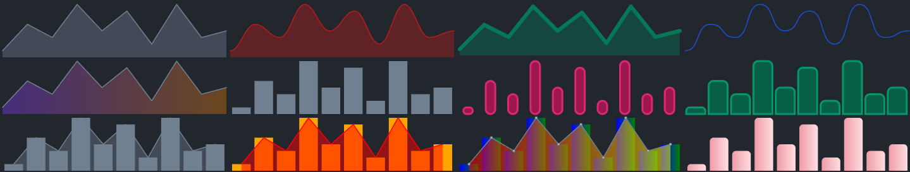

# React Sparklines


[](#license)

### [**Documentation**](https://lueton.github.io/react-sparklines/) • [**Installation**](https://lueton.github.io/react-sparklines/getting-started/installation) • [**Quickstart**](https://lueton.github.io/react-sparklines//getting-started/quick-start) • [**Roadmap**](https://lueton.github.io/react-sparklines/roadmap)



## Installation

```bash [npm]
npm install @lueton/react-sparklines

pnpm add @lueton/react-sparklines

yarn add @lueton/react-sparklines
```

## Quickstart

```jsx
const data = [1, 5, 3, 8, 4, 7, 2, 8, 3, 4];
<SparklinesLine data={data} />

<SparklinesBar data={data} />

<SparklinesComposed data={data}>
  <Bar />
  <Line />
</SparklinesComposed>
```

## License

Released under [MIT](/LICENSE) by [@Lueton](https://github.com/Lueton).